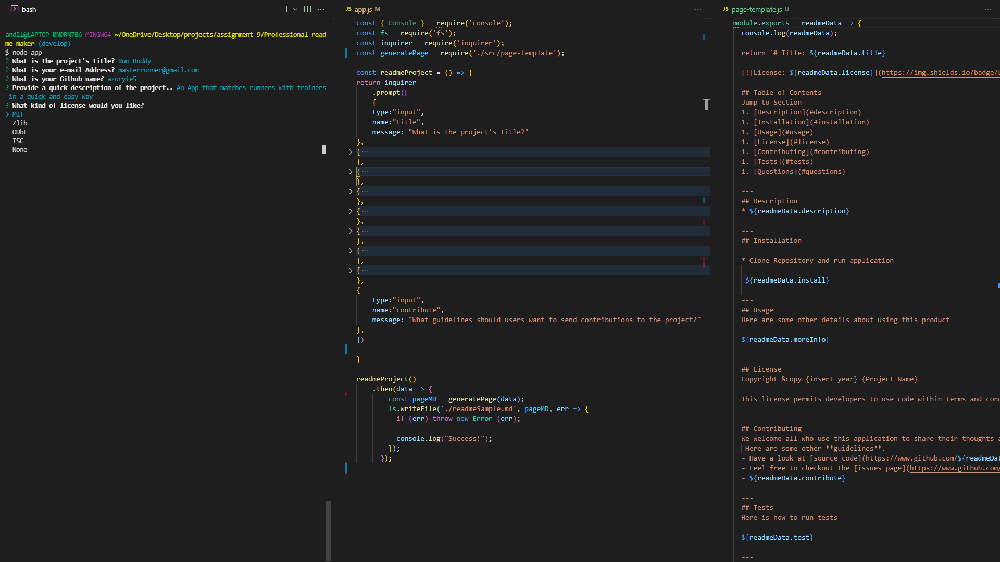

# Professional-readme-maker

## Challenge 9
---
## Table of Contents
1. [Links](#links)
1. [Usage](#usage)
1. [Assignment Details](#assignment-details)
1. [Tech Used](#tech-used)
1. [Credits](#credits)
---
## Links
* The URL of the GitHub repository: https://github.com/azuryte5/Professional-readme-maker

* The link to the Screencastify video: https://watch.screencastify.com/v/S0vWDyVWsjsh8siVCmOC
---
## Usage

App.js when run in node will generate a Readme file after prompts are received from user inputs. View link to video above for a brief overview of produce. 



Order of application
1. Run node.js
    * Note that Project title should be name of repo
1. User answers inquirer prompts
1. After last question, data is sent do page-template.js
1. page-template adds data to pre-defined readme template
1. App.js uses contents of page-template(+data) to generate sample readme
1. User can use readme as needed

---
## Tech Used
Content | Resourses
--------| ---------
[Node.js](https://nodejs.org/api/fs.html) | [Mastering Markdown](https://guides.github.com/features/mastering-markdown/)
[Inquirer.js](https://www.npmjs.com/package/inquirer) | [Badges](https://gist.github.com/lukas-h/2a5d00690736b4c3a7ba)
[Screencastify](https://www.screencastify.com) |


## Assignment Details

### As a Developer
```
I WANT a README generator
SO THAT I can quickly create a professional README for a new project
```

### Acceptance Criteria
```
GIVEN a command-line application that accepts user input
WHEN I am prompted for information about my application repository
[✔️]THEN a high-quality, professional README.md is generated with the title of my project and sections entitled Description, Table of Contents, Installation, Usage, License, Contributing, Tests, and Questions
WHEN I enter my project title
[✔️]THEN this is displayed as the title of the README
WHEN I enter a description, installation instructions, usage information, contribution guidelines, and test instructions
[✔️]THEN this information is added to the sections of the README entitled Description, Installation, Usage, Contributing, and Tests
WHEN I choose a license for my application from a list of options
[✔️]THEN a badge for that license is added near the top of the README and a notice is added to the section of the README entitled License that explains which license the application is covered under
WHEN I enter my GitHub username
[✔️]THEN this is added to the section of the README entitled Questions, with a link to my GitHub profile
WHEN I enter my email address
[✔️]THEN this is added to the section of the README entitled Questions, with instructions on how to reach me with additional questions
WHEN I click on the links in the Table of Contents
[✔️]THEN I am taken to the corresponding section of the README
```
---
### Credits
Made by Andrew Lefebvre 🏗️
